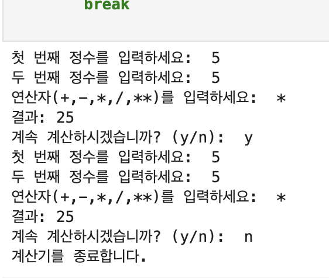
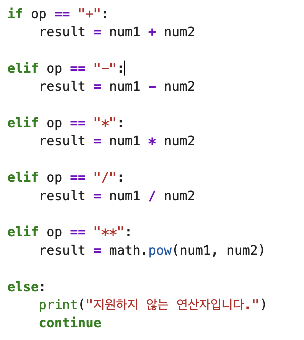

# AIFFEL Campus Online Code Peer Review Templete
- 코더 : 정슬기
- 리뷰어 : 이다겸


# PRT(Peer Review Template)
- [x]  **1. 주어진 문제를 해결하는 완성된 코드가 제출되었나요?**
      
주어진 문제에서 요구하는 바를 정상적으로 수행하였다.    



    
- [ ]  **2. 전체 코드에서 가장 핵심적이거나 가장 복잡하고 이해하기 어려운 부분에 작성된 
주석 또는 doc string을 보고 해당 코드가 잘 이해되었나요?**
코드에 따로 주석이 없어 평가 불가 
        
- [ ]  **3. 에러가 난 부분을 디버깅하여 문제를 해결한 기록을 남겼거나
새로운 시도 또는 추가 실험을 수행해봤나요?**
코드에 디버깅 기록 또는 새로운 시도에 대한 내용이 없어 평가 불가 
        
- [ ]  **4. 회고를 잘 작성했나요?**
회고 내역이 없어 평가 불가 
        
- [x]  **5. 코드가 간결하고 효율적인가요?**    
if-elif-else 구문을 활용하여, 입력받은 연산자에 따라 연산 결과를 result 변수에 할당하는 코드는 간결하여 효율적이라 할 수 있다.




# 회고(참고 링크 및 코드 개선)
```
# 리뷰어의 회고를 작성합니다.
# 코드 리뷰 시 참고한 링크가 있다면 링크와 간략한 설명을 첨부합니다.
# 코드 리뷰를 통해 개선한 코드가 있다면 코드와 간략한 설명을 첨부합니다.
```
지금 코드에서 지원하지 않는 연산자를 만날 경우, continue 에 의해서  

```python
again = input("계속 계산하시겠습니까? (y/n): ")

    if again.lower() != "y":
        print("계산기를 종료합니다.")
        break
```
이 코드가 실행되지 않고, while 문 앞으로 돌아간다.   
따라서 연산자를 잘못 입력하였을 때 계산이 한 번 종료되었다고 프로그램을 구상할 경우에는 계산 종료 사인을 줄 수 있도록 구조를 변경해야 한다.  
다만 지금의 코드는 연산자를 잘못 입력한 경우 곧바로 다시 입력을 받는 구조로 되어 있으므로 문제는 없다. 

그리고 현재 코드 진행 상, 입력 오류가 발생했을 때도 `agins = input(...)` 구문이 실행되므로 입력오류가 발생했는데 계산을 계속하겠냐고 물어보는 약간 어색한 상황이 발생할 수 있다. 
이는 except 구문 마지막에 continue를 붙여서 오류가 발생하면 while문 맨 앞으로 돌아가서 다시 입력을 받는 구조로 하는 것이 사용자 입장에서 조금 더 매끄럽지 않을까 생각한다. 

