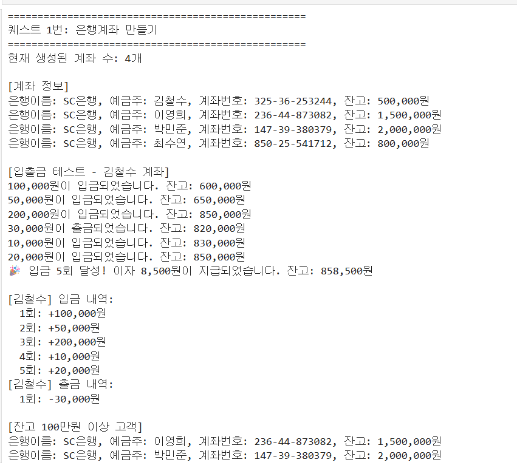
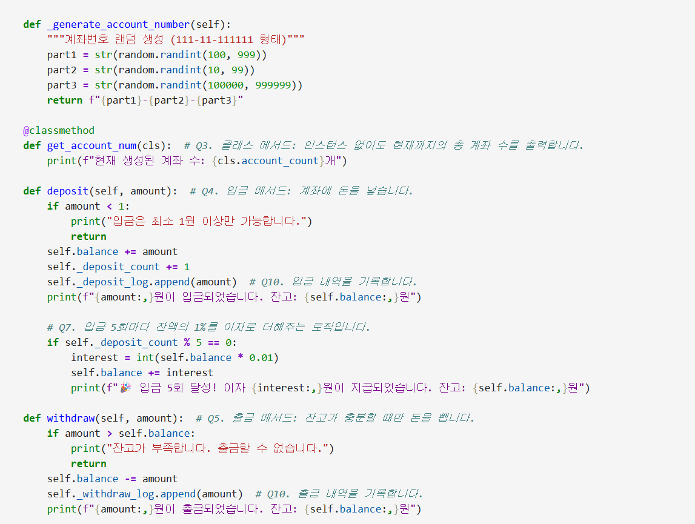
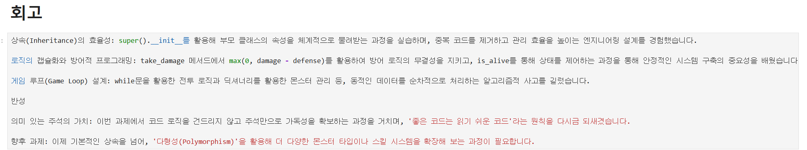
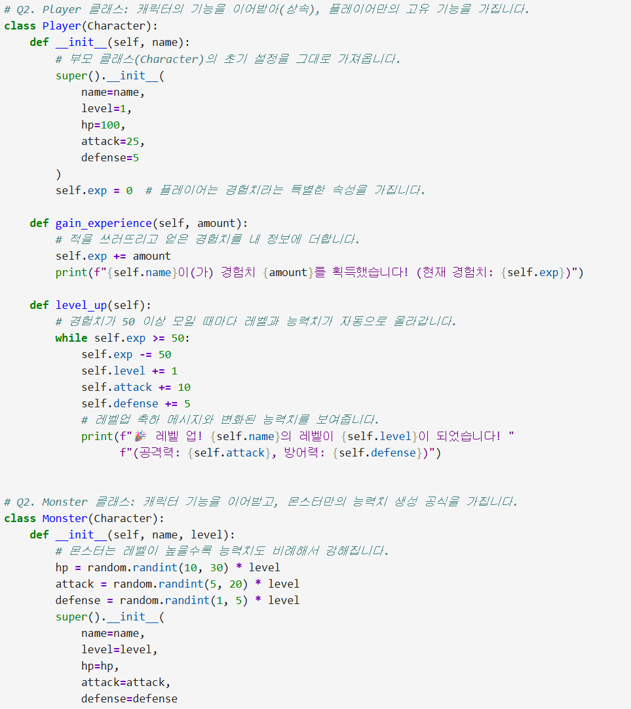

# AIFFEL Campus Online Code Peer Review Templete
- 코더 : 정슬기  
- 리뷰어 : 임성배  


# PRT(Peer Review Template)
- [X]  **1. 주어진 문제를 해결하는 완성된 코드가 제출되었나요?**
    - 문제에서 요구한 최종 결과물이 제출된 것을 확인하였습니다.   
    -   
    
- [X]  **2. 전체 코드에서 가장 핵심적이거나 가장 복잡하고 이해하기 어려운 부분에 작성된 
주석 또는 doc string을 보고 해당 코드가 잘 이해되었나요?**
    - 세부 퀘스트 항목 별로 코드 상에서 어디에 해당하는지 주석을 입력하여 이해하기 쉽도록 작성하였습니다.  
    -   
        
- [ ]  **3. 에러가 난 부분을 디버깅하여 문제를 해결한 기록을 남겼거나
새로운 시도 또는 추가 실험을 수행해봤나요?**
    - 문제 원인 및 해결 과정을 잘 기록하였는지 확인
    - 프로젝트 평가 기준에 더해 추가적으로 수행한 나만의 시도, 
    실험이 기록되어 있는지 확인
        - 중요! 잘 작성되었다고 생각되는 부분을 캡쳐해 근거로 첨부
        
- [X]  **4. 회고를 잘 작성했나요?**
    - 퀘스트를 진행하며 핵심 로직에 대한 복기와 더불어 향후 과제까지 기술하여 완벽한 회고 작성을 하였습니다.  
    -    
        
- [X]  **5. 코드가 간결하고 효율적인가요?**
    - 상속을 통해 효율적으로 코드 설계를 한 것을 확인하였습니다.  
    -   


# 회고(참고 링크 및 코드 개선)
```
# 리뷰어의 회고를 작성합니다.
# 코드 리뷰 시 참고한 링크가 있다면 링크와 간략한 설명을 첨부합니다.
# 코드 리뷰를 통해 개선한 코드가 있다면 코드와 간략한 설명을 첨부합니다.
```

퀘스트 별 세부 퀘스트 항목들을 어떻게 코딩하였고, 어떻게 동작하는지 주석을 통해 상세히 기재하였고, 이를 통해 처음 보는 사람도 쉽게 이해할 수 있도록 편의성을 높인 부분이 좋은 인사이트를 주었습니다.  
회고를 통해 이번 퀘스트에서 중요한 핵심 기능을 잘 정리하였고, 향후 과제를 통해 확장된 형태까지 기술하여서 많은 도움이 되었습니다.  
수고하셨습니다. (_ _)  
