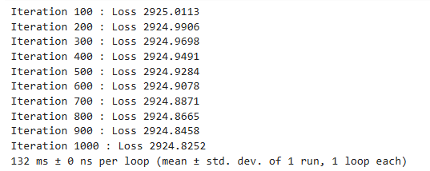
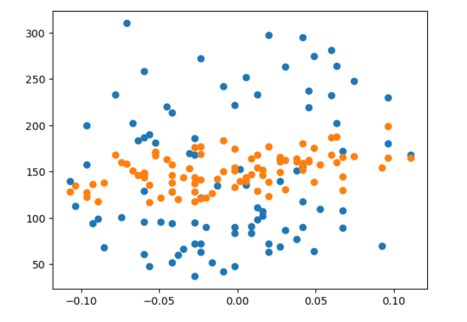
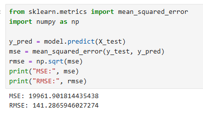
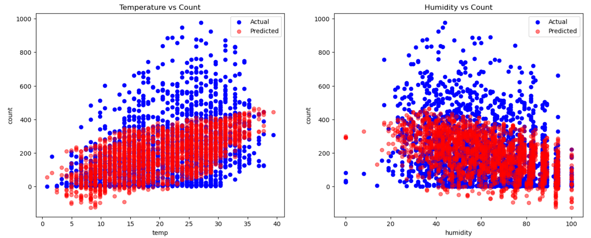
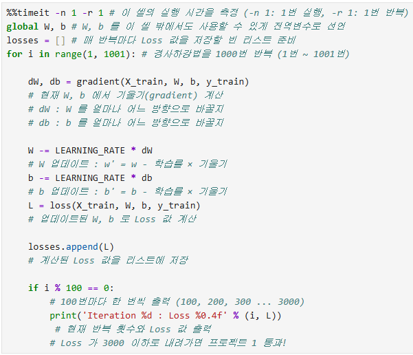
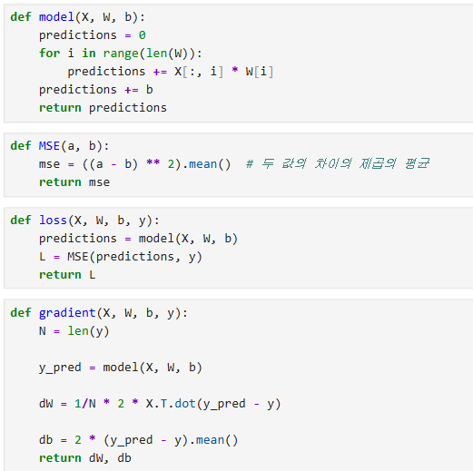

# AIFFEL Campus Online Code Peer Review Templete
- 코더 : 정슬기
- 리뷰어 : 서한호


# PRT(Peer Review Template)
- [x]  **1. 주어진 문제를 해결하는 완성된 코드가 제출되었나요?**
    - 문제에서 요구하는 최종 결과물이 첨부되었는지 확인
        - 중요! 해당 조건을 만족하는 부분을 캡쳐해 근거로 첨부  
리뷰  
문제의 결과물이 잘 출력 되었고, 평가기준의 값, 시각화 데이터를 잘 확인할 수 있었습니다.



  
    
- [x]  **2. 전체 코드에서 가장 핵심적이거나 가장 복잡하고 이해하기 어려운 부분에 작성된 
주석 또는 doc string을 보고 해당 코드가 잘 이해되었나요?**
    - 해당 코드 블럭을 왜 핵심적이라고 생각하는지 확인
    - 해당 코드 블럭에 doc string/annotation이 달려 있는지 확인
    - 해당 코드의 기능, 존재 이유, 작동 원리 등을 기술했는지 확인
    - 주석을 보고 코드 이해가 잘 되었는지 확인
        - 중요! 잘 작성되었다고 생각되는 부분을 캡쳐해 근거로 첨부  
리뷰  
이 부분의 코드를 주석으로 처리하여, 코드의 설명을 상세히 기입해주셔서 이해하기 수월하였습니다.  
  
        
- [ ]  **3. 에러가 난 부분을 디버깅하여 문제를 해결한 기록을 남겼거나
새로운 시도 또는 추가 실험을 수행해봤나요?**
    - 문제 원인 및 해결 과정을 잘 기록하였는지 확인
    - 프로젝트 평가 기준에 더해 추가적으로 수행한 나만의 시도, 
    실험이 기록되어 있는지 확인
        - 중요! 잘 작성되었다고 생각되는 부분을 캡쳐해 근거로 첨부
리뷰  
문제의 해결한 기록, 새로운 시도 및 추가 실험 내용은 없어 좀 아쉬웠습니다.
 
        
- [ ]  **4. 회고를 잘 작성했나요?**
    - 주어진 문제를 해결하는 완성된 코드 내지 프로젝트 결과물에 대해
    배운점과 아쉬운점, 느낀점 등이 기록되어 있는지 확인
    - 전체 코드 실행 플로우를 그래프로 그려서 이해를 돕고 있는지 확인
        - 중요! 잘 작성되었다고 생각되는 부분을 캡쳐해 근거로 첨부
리뷰  
회고가 작성되지 않았습니다.  
        
- [x]  **5. 코드가 간결하고 효율적인가요?**
    - 파이썬 스타일 가이드 (PEP8) 를 준수하였는지 확인
    - 코드 중복을 최소화하고 범용적으로 사용할 수 있도록 함수화/모듈화했는지 확인
        - 중요! 잘 작성되었다고 생각되는 부분을 캡쳐해 근거로 첨부
리뷰  
코드를 함수화 하여 코드를 간결하게 잘 작성하셨습니다.  
  

# 회고(참고 링크 및 코드 개선)
```
# 리뷰어의 회고를 작성합니다.
# 코드 리뷰 시 참고한 링크가 있다면 링크와 간략한 설명을 첨부합니다.
# 코드 리뷰를 통해 개선한 코드가 있다면 코드와 간략한 설명을 첨부합니다. 

```
전체적인 코드가 잘 정리 되어있었고, 부분적으로 주석처리도 되어있었으나, 전체적으로 주석이  
달려있었다면  이해하고, 접근하기 좋았을거 같습니다. 하지만 4주라는 짧은시간 안에 이 내용들을  
이해하기 어려울거란 공감이 됩니다.  앞으로 더욱 힘들겠지만, 포기하지않고 같이 수료해봐요!!  