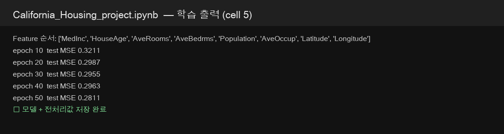
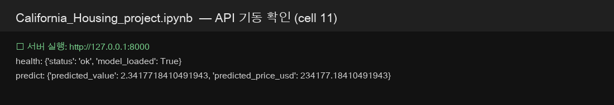
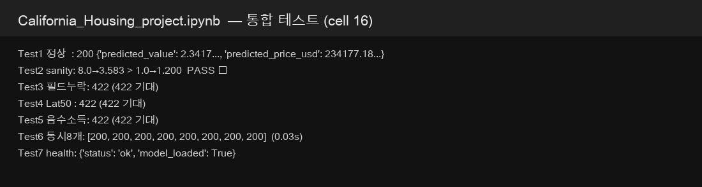
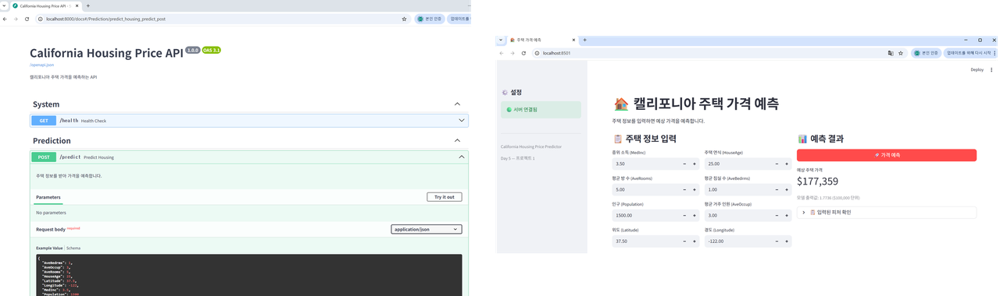
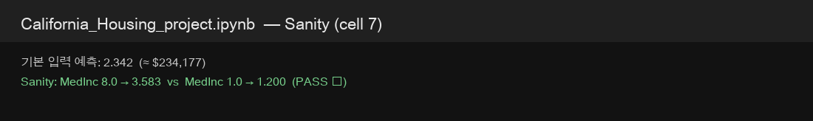

# AIFFEL Campus Online Code Peer Review Templete

- 코더 : 정슬기
- 리뷰어 : 최승현

리뷰 대상:

- [`California_Housing_project.ipynb`](./California_Housing_project.ipynb) — End-to-End 실행 노트북 (출력 포함)
- [`DP05_notebook_filled.ipynb`](./DP05_notebook_filled.ipynb) — 강의 노트북 빈칸·체크포인트 작성본

---

# PRT(Peer Review Template)

- [x] **1. 주어진 문제를 해결하는 완성된 코드가 제출되었나요?**
  - 문제에서 요구하는 최종 결과물이 첨부되었는지 확인
  - 중요! 해당 조건을 만족하는 부분을 캡쳐해 근거로 첨부

  **판단: 충족.** Day 5가 요구하는 정형 회귀 서비스가 `California_Housing_project.ipynb`에 한 흐름으로 구현되어 있고, 셀이 실제로 실행된 출력이 남아 있다.

  | 요구 | 제출 내용 |
  |------|-----------|
  | 학습 + 전처리 저장 | 50 epoch, test MSE **0.2811**, `housing_model.pth` + `housing_preprocessing.json` |
  | FastAPI | `POST /predict`, `GET /health`, Pydantic 범위 검증 |
  | Streamlit | 8개 `number_input` → API 호출 → `st.metric` |
  | 통합 테스트 | 정상 200, 필드 누락/위도 이탈/음수 소득 422, 동시 8개 200, health ok |

  학습 로그:

  

  API 기동:

  

  통합 테스트 7종:

  

  Streamlit 대시보드(노트북에 첨부된 화면):

  

  `DP05_notebook_filled.ipynb`는 강의 구조와 `# *your code*` 채움·섹션 체크포인트가 있으나 **실행 출력은 없다.** 실행 근거는 프로젝트 노트북 쪽이 본 제출물의 핵심이다.

- [x] **2. 전체 코드에서 가장 핵심적이거나 가장 복잡하고 이해하기 어려운 부분에 작성된 주석 또는 doc string을 보고 해당 코드가 잘 이해되었나요?**
  - 해당 코드 블럭을 왜 핵심적이라고 생각하는지 확인
  - 해당 코드 블럭에 doc string/annotation이 달려 있는지 확인
  - 해당 코드의 기능, 존재 이유, 작동 원리 등을 기술했는지 확인
  - 주석을 보고 코드 이해가 잘 되었는지 확인
  - 중요! 잘 작성되었다고 생각되는 부분을 캡쳐해 근거로 첨부

  **판단: 대체로 충족.** 핵심은 “학습 때 쓴 mean/std·피처 순서를 추론에서 그대로 쓰는 것”과 “프론트 JSON 키 = Pydantic 필드”인데, 이 두 계약이 코드와 체크포인트에 분명히 적혀 있다.

  `frontend/app_housing.py` — 데이터 계약을 주석으로 못 박은 부분:

  ```python
  # 8개 입력 (Key 이름은 FastAPI Schema와 완전히 동일해야 함 = 데이터 계약)
  ```

  `DP05_notebook_filled.ipynb` 섹션 2 체크포인트 — Silent Error(순서 어긋남)와 데이터 누수를 말로 풀어 쓴 점이 가장 이해가 잘 됐다.

  > 모델은 입력 8개를 값이 아니라 '자리(순서)'로 구분. 학습 때와 순서가 다르면 값이 엉뚱한 자리에 들어가 에러 없이 예측이 완전히 틀리는 Silent Error 발생.

  `HousingPredictor.predict()`도 같은 원리를 한 줄로 구현한다.

  ```python
  x = np.array([[float(features[n]) for n in self.feature_names]], dtype=np.float32)
  x = (x - self.mean) / self.std
  ```

  **아쉬운 점:** `app/housing_model.py`의 클래스에는 docstring이 거의 없다. `housing_api.py`의 `predict`가 왜 `def`(스레드풀)인지, Day 3의 `run_in_executor`를 안 쓴 이유도 코드 옆에는 없다. 동작은 읽히지만 “왜 이 형태인지”는 프로젝트 노트북 회고를 봐야 한다.

- [x] **3. 에러가 난 부분을 디버깅하여 문제를 해결한 기록을 남겼거나 새로운 시도 또는 추가 실험을 수행해봤나요?**
  - 문제 원인 및 해결 과정을 잘 기록하였는지 확인
  - 프로젝트 평가 기준에 더해 추가적으로 수행한 나만의 시도, 실험이 기록되어 있는지 확인
  - 중요! 잘 작성되었다고 생각되는 부분을 캡쳐해 근거로 첨부

  **판단: 충족(추가 실험 쪽).** 긴 디버그 일지는 없지만, 과제 기준을 넘는 **sanity 실험**이 있다. 소득만 바꿔 가격이 같이 오르는지 확인했다.

  

  - `MedInc 8.0 → 3.583` vs `MedInc 1.0 → 1.200` (PASS)
  - 학습 셀에서 `assert list(data.feature_names) == FEATURE_NAMES`로 피처 순서 불일치를 학습 전에 막음
  - 통합 테스트에 위도 50, 음수 소득, 필드 누락을 넣어 422를 기대값으로 명시

  강의 노트북의 4종 테스트보다 **Test 2 sanity + Test 5 음수 소득**이 추가로 보인다. “서버가 200만 주면 된다”가 아니라 **모델이 소득 방향성을 학습했는지**까지 본 점이 좋다.

  디버그 서사는 짧다. Colab iframe이 안 뜰 때 “이 셀만 다시 실행” 안내 정도는 있다. 실패한 스택을 고친 기록은 없다.

- [x] **4. 회고를 잘 작성했나요?**
  - 배운점과 아쉬운점, 느낀점 등이 기록되어 있는지 확인
  - 전체 코드 실행 플로우를 그래프로 그려서 이해를 돕고 있는지 확인
  - 중요! 잘 작성되었다고 생각되는 부분을 캡쳐해 근거로 첨부

  **판단: 프로젝트 노트북 기준으로 충족.** `California_Housing_project.ipynb` 마지막 셀에 산출물 목록, 핵심 4가지, 배운 점이 정리되어 있다.

  코더가 그린 흐름(노트북 상단):

  ```
  사용자 → Streamlit(:8501) → FastAPI(:8000) → PyTorch 회귀 모델 → 예측 가격 → 화면 표시
  ```

  핵심 4가지 요약:

  1. 학습·추론 전처리 일치 (mean/std 재사용, Silent Error 방지)
  2. API 입력 방어 (위도/경도/양수, 422)
  3. 프론트 키 = 스키마 필드 (데이터 계약)
  4. 정상 + 에러 + 동시 요청

  `DP05_notebook_filled.ipynb` 섹션 6은 강의 표 이미지와 최종 체크포인트(Q1~Q5)만 있고, **6.1~6.3을 자기 문장으로 풀어 쓴 회고는 없다.** 회고 본문은 프로젝트 노트북에 모여 있다.

  리뷰어가 코드를 따라 다시 그린 실행 흐름:

  ```mermaid
  flowchart LR
    User["사용자"] --> ST["Streamlit :8501"]
    ST -->|JSON 8필드| API["FastAPI :8000"]
    API --> Schema["HousingInput Pydantic"]
    Schema --> Pred["HousingPredictor"]
    Pred --> Norm["저장된 mean/std"]
    Norm --> MLP["HousingRegressionModel"]
    MLP --> API
    API -->|predicted_price_usd| ST
  ```

- [x] **5. 코드가 간결하고 효율적인가요?**
  - 파이썬 스타일 가이드 (PEP8) 를 준수하였는지 확인
  - 코드 중복을 최소화하고 범용적으로 사용할 수 있도록 함수화/모듈화했는지 확인
  - 중요! 잘 작성되었다고 생각되는 부분을 캡쳐해 근거로 첨부

  **판단: 충족.** 역할이 파일 단위로 나뉘어 있고, 프론트 입력 8개를 루프로 만들어 중복이 적다.

  ```
  app/housing_model.py       모델 + HousingPredictor
  app/housing_schemas.py     Pydantic
  app/housing_api.py         FastAPI
  frontend/app_housing.py    Streamlit
  ```

  좋은 점:

  - 위젯 8개를 `defaults` dict + `enumerate`로 생성 → 필드가 늘어도 한곳만 고치면 됨
  - `FEATURE_NAMES`를 모델 모듈에 두고 학습 셀에서 assert
  - 미들웨어 로깅 + 글로벌 500 핸들러로 스택을 클라이언트가 못 보게 함

  개선하면 좋은 점:

  - `/predict`가 동기 `def`라 FastAPI 기본 스레드풀에 맡긴다. 강의의 `async def` + `run_in_executor` 패턴은 빠져 있다. 동시 8개가 0.03초에 끝난 건 스레드풀 덕분이라 동작은 맞지만, Day 3에서 배운 “이벤트 루프를 직접 비우기”는 코드에 안 보인다.
  - `HousingPredictor` 기본 경로가 cwd 상대 경로라, 작업 디렉터리가 바뀌면 로드가 깨질 수 있다.
  - 모델에 Dropout이 없고 lr=0.01이라 강의 기본(1e-3, Dropout 0.2)과 다르다. 성능(MSE 0.28)은 나와서 문제는 아니지만, 하이퍼파라미터 선택 이유는 없다.

---

# 회고(참고 링크 및 코드 개선)

코더(정슬기)의 End-to-End 노트북은 **실행 결과까지 남는 제출**이라 리뷰하기 좋았다. 강의 노트북(`DP05_notebook_filled.ipynb`)에서 개념(누수, Silent Error, 데이터 계약)을 글로 답하고, 프로젝트 노트북에서 그걸 테스트로 증명한 구성이다.

특히 Test2 sanity(소득↑ → 가격↑)는 과제 체크리스트에 없어도 모델을 신뢰할 수 있는지 보는 실험이라 인상 깊었다. 필드 누락·범위 이탈을 422로 막는 것도 Day 2 스키마 수업을 제대로 쓴 느낌이다.

아쉬운 점은 두 가지다. 첫째, 강의 노트북 섹션 6 회고는 표 이미지만 있고 자기 문장은 프로젝트 노트북에만 있다. 제출을 찾는 사람은 `California_Housing_project.ipynb` 마지막 셀을 봐야 한다. 둘째, Day 3의 `run_in_executor`가 빠져 있다. 지금은 `def` 엔드포인트라 큰 사고는 안 나지만, 나중에 `async def`로 바꾸면 이벤트 루프가 막힐 수 있으니 주석이라도 남기면 좋겠다.

## 참고 링크

| 링크 | 설명 |
|------|------|
| [FastAPI concurrency (def vs async def)](https://fastapi.tiangolo.com/async/) | 동기 `def`는 스레드풀, `async def` 안 블로킹은 루프를 막음 |
| [Pydantic Field constraints](https://docs.pydantic.dev/latest/concepts/fields/) | `gt` / `ge` / `le`로 422를 내는 방식 |
| [sklearn California Housing](https://scikit-learn.org/stable/modules/generated/sklearn.datasets.fetch_california_housing.html) | 8 피처·타깃 단위($100,000) |

## 개선 제안 (선택)

`async`로 바꿀 때 추론만 스레드풀로 넘기는 형태:

```python
@app.post("/predict", response_model=HousingPrediction)
async def predict(inp: HousingInput):
    loop = asyncio.get_running_loop()
    value = await loop.run_in_executor(None, predictor.predict, inp.model_dump())
    return HousingPrediction(predicted_value=value, predicted_price_usd=value * 100000)
```

경로도 `Path(__file__).resolve().parent.parent / "models"`처럼 파일 기준이면 노트북 밖에서 서버를 띄워도 모델 로드가 안정적이다.
